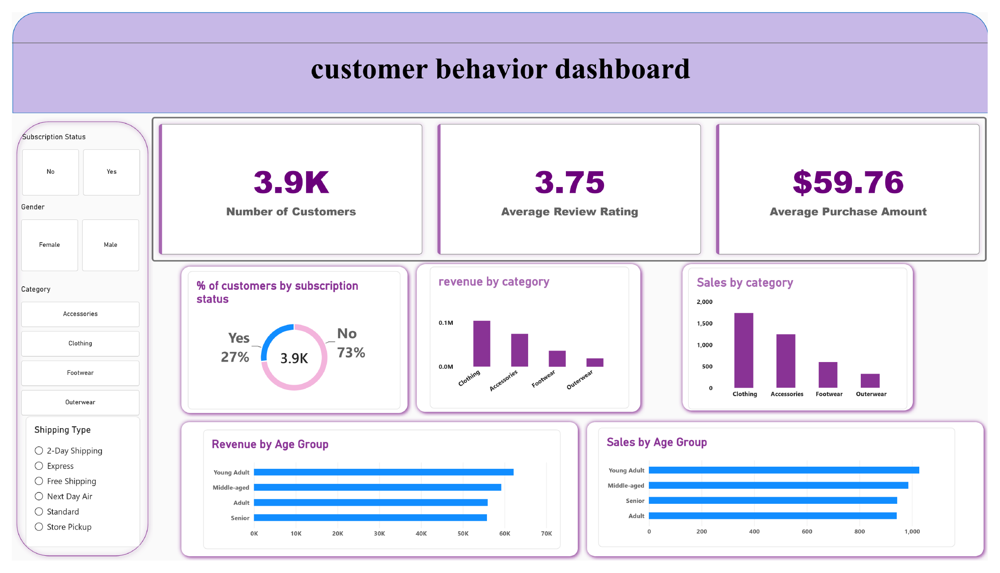

# Customer Shopping Behavior Analysis

A complete data analytics portfolio project analyzing retail customer shopping
trends using **Python, SQL, and Power BI**.

## 📌 Project Overview

This project explores a retail customer dataset to uncover patterns in
spending, product preferences, seasonality, and customer segments. It follows
an end-to-end analytics workflow: data cleaning in Python, storage and
analysis in SQL, and visualization in Power BI.

## 🎯 Business Questions

- Which product categories and items generate the most revenue?
- How does spending vary by age group, gender, and season?
- Do discounts and subscriptions correlate with higher order value?
- Which customer segment looks most valuable (frequent + high spend)?

## 🛠️ Tech Stack

| Stage         | Tool                                  |
|---------------|----------------------------------------|
| Data cleaning | Python (pandas)                        |
| Storage       | SQL (PostgreSQL / MySQL / SQL Server)  |
| Analysis      | SQL                                     |
| Visualization | Power BI                                |

## 📁 Project Structure

```
customer-shopping-behavior-project/
├── customer_shopping_behavior.csv           # Raw dataset
├── customer_shopping_behavior_cleaned.csv   # Output of clean_data.py
├── Customer_Shopping_Behavior_Analysis.ipynb # Exploratory notebook
├── clean_data.py                             # Cleaning & feature engineering pipeline
├── load_to_sql.py                            # Loads cleaned data into a SQL database
├── customer_behavior_sql_queries.sql         # Analysis queries
├── customer_behavior_dashboard.pbix          # Power BI dashboard
├── dashboard.png                             # Dashboard preview image
├── Customer_Shopping_Behavior_Analysis_Report.docx # Written report with SQL screenshots
├── requirements.txt                          # Python dependencies
├── .env.example                              # Template for DB credentials
├── .gitignore                                # Keeps .env out of git
└── README.md
```

## 🚀 How to Run

1. **Install dependencies**
   ```bash
   pip install -r requirements.txt
   ```

2. **Clean the data**
   ```bash
   python clean_data.py
   ```
   This produces `customer_shopping_behavior_cleaned.csv`.

3. **Set your database credentials**
   Copy `.env.example` to `.env` (git-ignored) and fill in your values, or
   export them directly. Never commit real credentials:
   ```bash
   export DB_USER=postgres
   export DB_PASSWORD=your_password
   ```

4. **Load into SQL**
   ```bash
   python load_to_sql.py --db postgres
   ```
   (`--db` also accepts `mysql` or `mssql`)

5. **Run the analysis queries**
   Open `customer_behavior_sql_queries.sql` in your SQL client of choice and
   run against the `customer` table.

6. **Build the Power BI dashboard**
   Connect Power BI Desktop to the same database/table and build visuals for
   revenue by category, spend by age group, seasonal trends, and the VIP
   customer segment.

## 🧹 Data Cleaning Steps

- Filled missing `review_rating` values with the median rating per category
- Standardized column names to snake_case
- Engineered `age_group` (quartile-based buckets)
- Engineered `purchase_frequency_days` from purchase frequency labels
- Dropped `promo_code_used` (redundant with `discount_applied`)

## 📈 Dashboard



The interactive version is in `customer_behavior_dashboard.pbix`. Open it in Power BI Desktop to use the Subscription Status, Gender, Category and Shipping Type filters.

## 📊 Key Findings

Dataset: **3,900 orders**, **$233,081** total revenue, **$59.76** average order, **3.75** average rating.

1. **Clothing and Accessories drive the business** – $104,264 and $74,200, together 76.6% of revenue. Average order value is similar in every category ($57–$60), so revenue differences come from order volume.
2. **Spending is very uniform** – average spend varies by only about $1.40 across age groups ($59.07–$60.45), and subscribers vs non-subscribers spend almost the same ($59.49 vs $59.87).
3. **Men account for ~68% of revenue** ($157,890 vs $75,191) because they place more orders (2,652 vs 1,248); average order value is nearly identical.
4. **Most customers are "Loyal"** (11+ previous purchases): 3,116 customers and $185,517 revenue (~80%). The threshold is too low to separate customers; see Limitations.
5. **Only 27% of customers subscribe** – and 72.4% of repeat buyers (5+ previous purchases) are not subscribed, a sizeable conversion target.
6. **Fall is the strongest season** ($60,018) and Summer the weakest ($55,777, ~7% lower).
7. **Discounts are heavily used on a few items** – Hat (50.0%), Sneakers (49.7%) and Coat (49.1%) are discounted on about half of orders.
8. **Top sellers / top rated** – Jewelry, Blouse/Pants, Sandals and Jacket lead their categories; Gloves (3.86) and Sandals (3.84) are the best rated.
9. **Payment methods and states are evenly spread** – PayPal leads with only 17.4% of orders; the top 10 states are within ~$600 of each other.

## ⚠️ Limitations

- Many differences (age, state, season, payment method) are small and were not statistically tested; treat them as directional.
- The "Loyal" segment (11+ purchases) covers ~80% of customers; percentile-based tiers would be more useful.
- The VIP query (above-average previous purchases and spend) matches 979 customers (~25%); the 25 rows shown are just the top of that list.
- 37 missing review ratings were imputed with the category median.
- The data has no dates or costs, so there is no time trend, churn, or margin/discount ROI analysis.

## 📄 License

MIT
